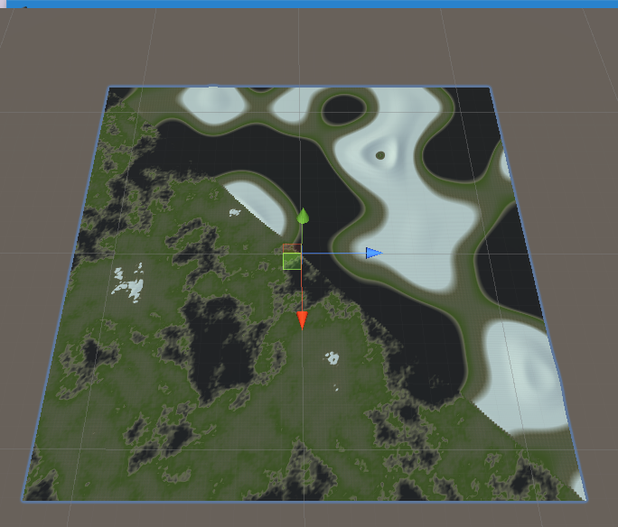
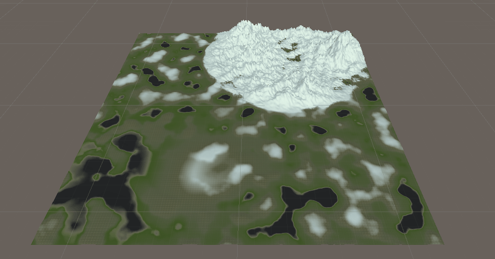

# Procedural-Landmass-Environement-Generation

this is a fork of the Procedural landmass project made by Sebastian Lague available (here)[https://github.com/SebLague/Procedural-Landmass-Generation]

This project aim is to add a variation to the generated world by adding regions with specific Heightmap settings.

 
As we can see here the transition between the two regions is not seamless.

# Result 

